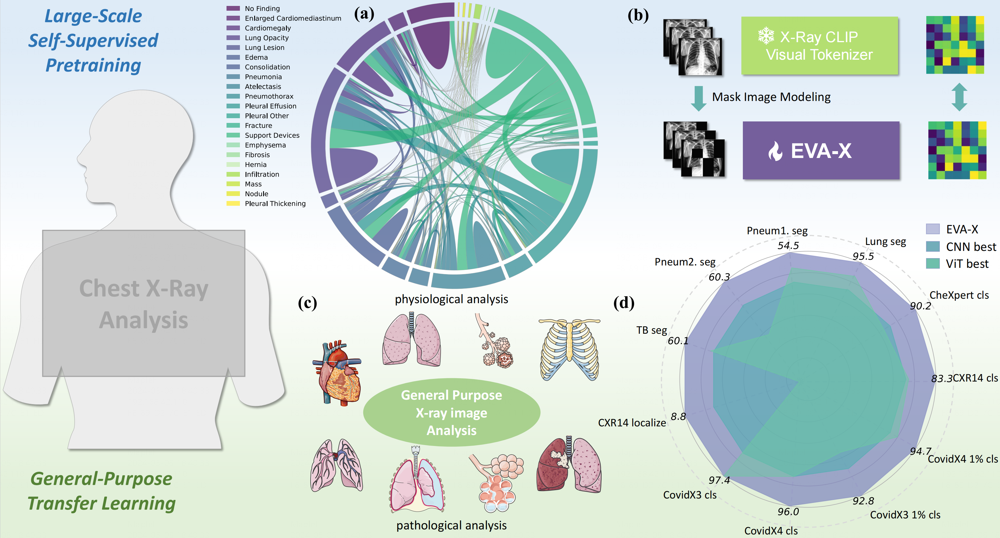
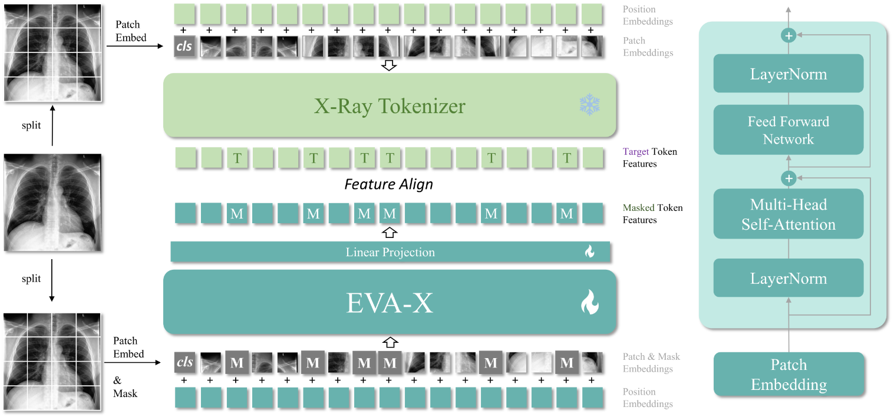

<div align="center">

#   *EVA-X*

## A foundation model for general chest X-ray analysis</br> with self-supervised learning </h2>


<p align="center">
    
</p>

**EVA-X are Vision Transformers (ViTs) pre-trained especially for medical X-ray images.**

**Take them away for your own X-ray tasks!**

#

[Jingfeng Yao](https://github.com/JingfengYao)<sup>1</sup>, [Xinggang Wang](https://scholar.google.com/citations?user=qNCTLV0AAAAJ&hl=zh-CN)<sup>1 📧</sup>, [Yuehao Song]()<sup>1</sup>, [Huangxuan Zhao]()<sup>2</sup>,</br> [Jun Ma]()<sup>3,4,5</sup>, [Yajie Chen]()<sup>1</sup>, [Wenyu Liu]()<sup>1</sup>, [Bo Wang]()<sup>3,4,5,6,7 📧</sup>

<sup>1</sup>School of Electronic Information and Communications, </br>Huazhong University of Science and Technology, Wuhan, Hubei, China

<sup>2</sup>Department of Radiology, Union Hospital, Tongji Medical College, </br>Huazhong University of Science and Technology, Wuhan, Hubei, China

<sup>3</sup>Peter Munk Cardiac Centre, University Health Network, Toronto, Ontario, Canada

<sup>4</sup>Department of Laboratory Medicine and Pathobiology, University of Toronto, Toronto, Ontario, Canada

<sup>5</sup>Vector Institute for Artificial Intelligence, Toronto, Ontario, Canada

<sup>6</sup>AI Hub, University Health Network, Toronto, Ontario, Canada

<sup>7</sup>Department of Computer Science, University of Toronto, Toronto, Ontario, Canada

(<sup>📧</sup>) corresponding author.

[](LICENSE)
[](https://github.com/hustvl)

</div>

## News

* **`May 08th, 2024`:**  EVA-X is realsed!

## Introduction

The diagnosis and treatment of chest diseases play a crucial role in maintaining human health. X-ray examination has become the most common clinical examination means due to its efficiency and cost-effectiveness. Artificial intelligence analysis methods for chest X-ray images are limited by insufficient annotation data and varying levels of annotation, resulting in weak generalization ability and difficulty in clinical dissemination. Here we present EVA-X, an innovative foundational model based on X-ray images with broad applicability to various chest disease detection tasks. EVA-X is the first X-ray image based self-supervised learning method capable of capturing both semantic and geometric information from unlabeled images for universal X-ray image representation. Through extensive experimentation, EVA-X has demonstrated exceptional performance in chest disease analysis and localization, becoming the first model capable of spanning over 20 different chest diseases and achieving leading results in over 11 different detection tasks in the medical field. Additionally, EVA-X significantly reduces the burden of data annotation in the medical AI field, showcasing strong potential in the domain of few-shot learning. The emergence of EVA-X will greatly propel the development and application of foundational medical models, bringing about revolutionary changes in future medical research and clinical practice.

<p align="center">
    
</p>

| EVA-X Series | Architecture | #Params | Checkpoint | Tokenizer |  MIM epochs |
|:------------:|:------------:|:-------:|:----------:|:----------:|:----------:|
|  EVA-X-Ti    |  ViT-Ti/16   | 6M      |  [🤗download](https://huggingface.co/MapleF/eva_x/blob/main/eva_x_tiny_patch16_merged520k_mim.pt)| MGCA-ViT-B/16 | 900 |
|  EVA-X-S    |  ViT-S/16   | 22M      |  [🤗download](https://huggingface.co/MapleF/eva_x/blob/main/eva_x_small_patch16_merged520k_mim.pt)|MGCA-ViT-B/16 | 600 |
|  EVA-X-B    |  ViT-B/16   | 86M      |  [🤗download](https://huggingface.co/MapleF/eva_x/blob/main/eva_x_base_patch16_merged520k_mim.pt)|MGCA-ViT-B/16 | 600 |

## Contents

EVA-X has released all experimental code from the paper. Here is our contents; please refer to the corresponding sections as needed.

Use EVA-X as your backbone:
- [Quick Start](#quick-start)

Finetuning:
- [X-ray Image Classification](classification)
- [X-ray Image Segmentation](segmentation)

Interpretability analysis:
- [Grad-CAM Analysis](grad_cam)

## Quick Start

**Countdown 3, 2, 1. Launch EVA-X.**

1. Download pre-trained weights.

2. Install [pytorch_image_models](https://github.com/huggingface/pytorch-image-models)
    ```
    ! pip install timm==0.9.0
    ```

3. Initialize EVA-X with 2-line python codes. You could also check ``eva_x.py`` to modify it for your own X-ray tasks.
    ```
    from eva_x import eva_x_tiny_patch16, eva_x_small_patch16, eva_x_base_patch16

    model = eva_x_small_patch16(pretrained=/path/to/pre-trained)
    ```
Try EVA-X representations for your own X-rays!

## Acknowledgements

Our codes are built upon [EVA](https://github.com/baaivision/EVA/tree/master/EVA-01), [EVA-02](https://github.com/baaivision/EVA/tree/master/EVA-02), [MGCA](https://github.com/HKU-MedAI/MGCA), [Medical MAE](https://github.com/lambert-x/medical_mae), [mmsegmentation](https://github.com/open-mmlab/mmsegmentation), [timm](https://github.com/huggingface/pytorch-image-models), [segmentation_models_pytorch](https://github.com/qubvel/segmentation_models.pytorch), [pytorch_grad_cam](https://github.com/jacobgil/pytorch-grad-cam) Thansk for these great repos!
