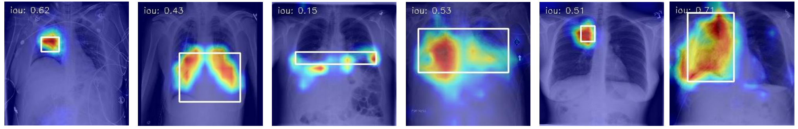

<h1 align="center">EVA-X: Grad CAMs of Finetuned Models</h1>

<div style="text-align:center"></div>

## Installation

1. Please follow [classification installation](../classification/README.md#intallation).

2. Install amazing repo of [pytorch-grad-cam](https://github.com/jacobgil/pytorch-grad-cam)

    ```
    pip install grad-cam
    ```

## Weights Preparing

Get finetuned weights from [EVA-X classification](../classification). Here, we only use models finetuned on **Chest X-Ray14** dataset.

## Run
Search for best thrd for final results. All of training codes are saved in ``get_cams.sh``.
```
python get_cams.py \
    --model eva_x_small \
    --ckpt /path/to/eva_x_small_patch16_merged520k_mim_cxr14_ft.pth \
    --save-path ./output/eva_grad_cam \
    --searching
```

Visualize Grad-CAMs
```
python get_cams.py \
    --model eva_x_small \
    --ckpt /path/to/eva_x_small_patch16_merged520k_mim_cxr14_ft.pth \
    --save-path ./output/eva_grad_cam \
    --thrd 0.4
```

The results will be saved into ``./output``

## Results

| Methods | Architecture | AP25 | AP50 | mIoU |mAP | Checkpoint |
|:------------|:------------:|:-------:|:----------:|:----------:|:----------:|:----------:|
| [MoCov2](https://arxiv.org/abs/2003.04297) | DenseNet121 | 10.98 | 1.42 | 8.18 | 6.20 | [🤗download](https://huggingface.co/MapleF/eva_x/blob/main/densenet121_mocov2_pt_cxr14_ft.pth) |
| [Medical MAE](https://arxiv.org/abs/2210.12843) | DenseNet121 | 8.33 | 2.13 | 6.90 | 5.23 | [🤗download](https://huggingface.co/MapleF/eva_x/blob/main/densenet121_medical_mae_pt_cxr14_ft.pth) |
| [BioViL](https://arxiv.org/abs/2204.09817) | ResNet50 | 11.59 | **3.46** | 7.29 | 7.52 | [🤗download](https://huggingface.co/MapleF/eva_x/blob/main/resnet50_biovil_pt_cxr14_ft.pth) |
| [MGCA](https://arxiv.org/abs/2210.06044) | ResNet50 | 7.22 | 2.34 | 5.00 | 4.78 |[🤗download](https://huggingface.co/MapleF/eva_x/blob/main/resnet50_mgca_pt_cxr14_ft.pth) |
| [MedKLIP](https://arxiv.org/abs/2301.02228) | ResNet50 | 5.69 | 2.74 | 4.94 | 4.22 | [🤗download](https://huggingface.co/MapleF/eva_x/blob/main/resnet50_medklip_pt_cxr14_ft.pth) |
| [Medical MAE](https://arxiv.org/abs/2210.12843) | ViT-S | 7.11 | 1.00 | 6.79 | 3.61 |  [official download](https://drive.google.com/file/d/1DkZMkXcFpj_SdffYZzw-Dq5clfo_YqjZ/view?usp=share_link)
| EVA-X (Ours) | ViT-S | **14.74** | 2.95 | **9.18** | **8.84** |  [🤗download](https://huggingface.co/MapleF/eva_x/blob/main/eva_x_small_patch16_merged520k_mim_cxr14_ft.pth)
