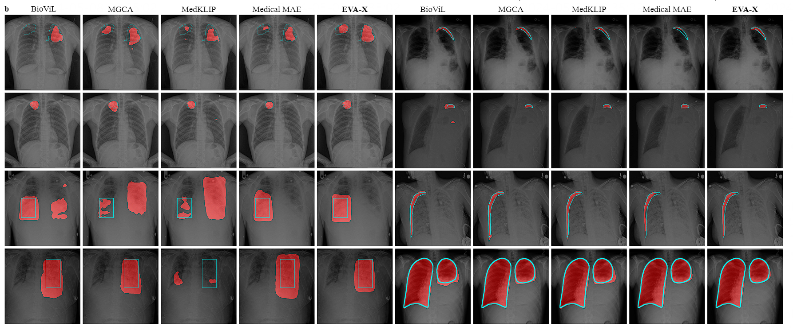

<h1 align="center"> EVA-X: X-Ray Image Segmentation </h1>

<div style="text-align:center"></div>

## Installation

1. Follow [classification installation](../classification/README.md#intallation).

2. Install ``mmsegmentation==0.29.1`` and its corresponding packages. You could install mmsegmentation==0.29.1 from souce by run:
    ```
    git clone https://github.com/open-mmlab/mmsegmentation
    git checkout 7b09967
    pip install -e .
    ```

3. build MSDA:
    ```
    cd ops
    sh make.sh
    ```

## Weights Preparation

Prepare weights following [X-ray image classification](../classification/README.md#weights-preparation). Put them in ``./pretrained``

NOTE: You should run ``python tools/interpolate14to16`` for EVA-X weights to convert precision from ``Half`` to ``Float``.

## Data Preparation

1. Download [SIIM-ACR Pneumothorax](https://www.kaggle.com/c/siim-acr-pneumothorax-segmentation/data) / [RSNA Pneumonia](https://www.kaggle.com/c/rsna-pneumonia-detection-challenge/data) / [Lung Segmentation]() / [Shenzhen Hospital]() dataset.

2. We random have splited the datasets to train/test images and **released our data split**. You could prepare the dataset by run:
    ```
    python data_splits/prepare_siim.py
    python data_splits/prepare_rsna.py
    ```
    The processed datasets will be saved in ``./dataset``.

## Training

All of the configs are saved in ``configs``. Each experiment has been done on a single RTX-3090 GPU. Choose the config and run an experiemnt by run:
```
python train.py segmentation/config/eva_x/upernet_eva_x_small_siim_50ep.py
```

## Results

All models have been finetuned on the same settings. We will upload the finetuned weights of EVA-X, evaluate finetuned models by running:

**Weights are coming soon...**

```
python test.py segmentation/config/eva_x/upernet_eva_x_small_siim_50ep.py \
       /path/to/checkpoint \
       --eval mIoU mDice
```

## Acknowledgements

Our codes are built upon [EVA-02](https://github.com/baaivision/EVA/tree/master/EVA-02), [mmsegmentation](https://github.com/open-mmlab/mmsegmentation/tree/v0.29.1), [MGCA](https://github.com/HKU-MedAI/MGCA), [segmentation_models_pytorch](https://github.com/qubvel/segmentation_models.pytorch). Thanks for their great work!
